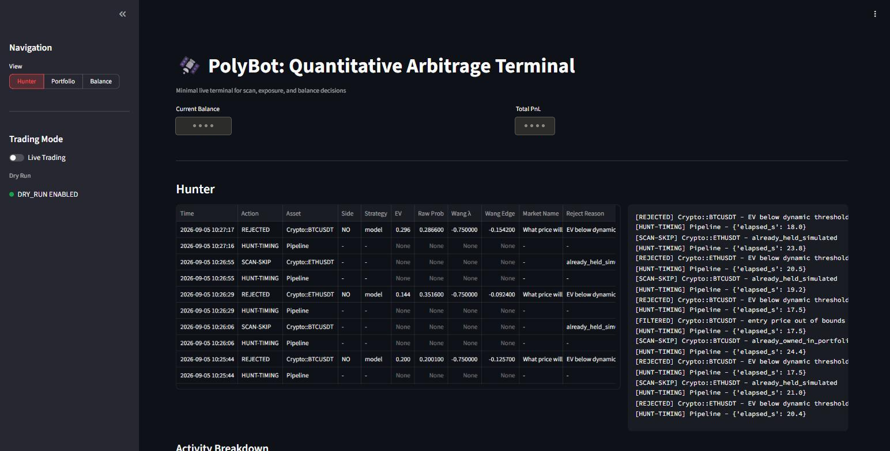
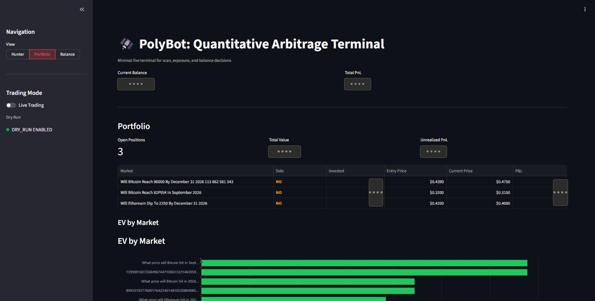
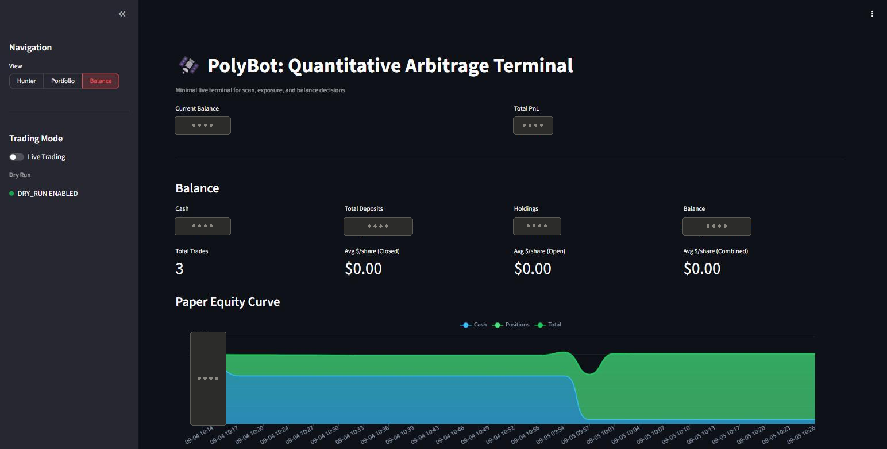
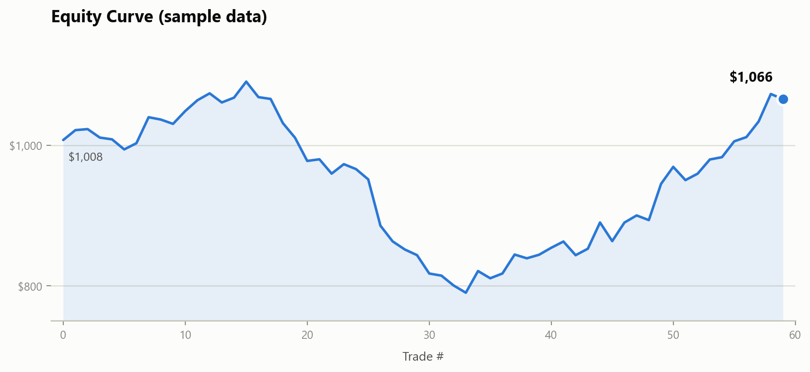
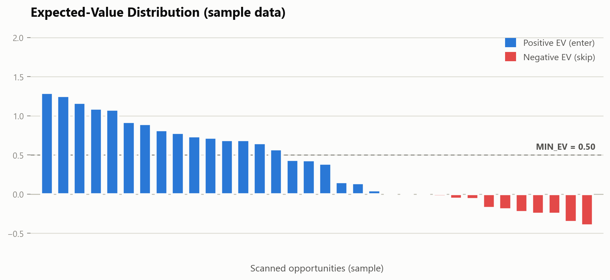
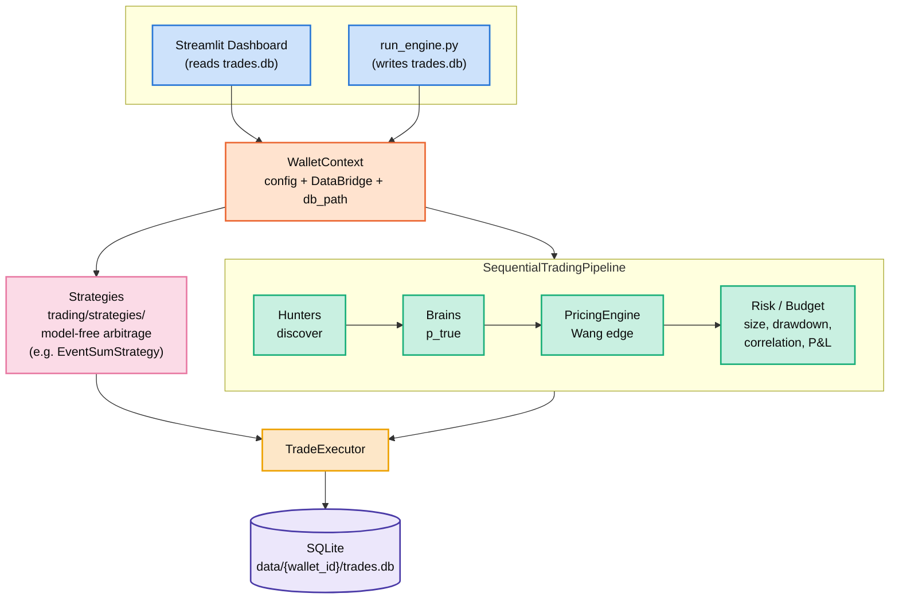

# PolyBot — Quantitative Arbitrage Terminal for Polymarket

[](https://github.com/idanmuallem/PolyBot/actions/workflows/deploy.yml)


A fully automated trading bot that hunts [Polymarket](https://polymarket.com) prediction markets for positive expected-value opportunities, evaluates them with domain-specific pricing models, and executes risk-managed trades — all surfaced through a live Streamlit dashboard.

---

## Table of Contents

- [Overview](#overview)
- [Screenshots](#screenshots)
- [Sample Charts](#sample-charts)
- [Architecture](#architecture)
- [Project Structure](#project-structure)
- [How It Works](#how-it-works)
- [Arbitrage Strategy — Isolation Status](#arbitrage-strategy--isolation-status-and-gated-entry-points)
- [Getting Started](#getting-started)
- [Configuration](#configuration)
- [Running the Dashboard](#running-the-dashboard)
- [Trading Modes](#trading-modes)
- [Running Tests](#running-tests)
- [Deployment](#deployment)
- [Environment Variables Reference](#environment-variables-reference)

---

## Overview

PolyBot scans Polymarket's prediction markets for mispriced contracts using real-world reference data (crypto spot prices, weather forecasts, macroeconomic indicators). When it finds a market where the on-chain price diverges from its fair-value estimate by more than the configured EV threshold, it enters a position — subject to daily budget limits, bankroll controls, and take-profit/stop-loss guards.

**Key capabilities:**

- Market discovery across crypto, weather, and macro asset classes
- Domain-specific fair-value models (Black-Scholes for crypto, normal-distribution for weather/economy)
- Kelly-criterion-based position sizing with hard budget caps
- Dry-run (virtual balance) and live-trading modes via a single `TRADING_MODE` switch
- Real-time dashboard with equity curve, open positions, and EV distribution
- Docker-based deployment to AWS EC2 via GitHub Actions CI/CD

---

## Screenshots

Captured from the live dashboard running in `TRADING_MODE=dry_run`. Balance, P&L, and position-size figures are redacted (blurred) — everything else (scan log, EV charts, market names, activity breakdown) is the real, unedited UI.

**Hunter** — live scan log with EV/Wang-edge coloring, rejection reasons, and the raw terminal feed:



**Portfolio** — open positions and per-market EV distribution:



**Balance** — deposits, holdings, and the paper equity curve:



---

## Sample Charts

Illustrative charts built from synthetic data (not a live account) showing the shape of what the **Balance** and **Portfolio** dashboard views track over time:

| Equity Curve | Expected-Value Distribution |
|---|---|
|  |  |
| Cumulative account equity across trades, with drawdown and recovery. | Each scanned opportunity's EV; blue clears `MIN_EV`, red is skipped. |

---

## Architecture

Each wallet runs as a fully isolated unit — its own `TradingConfig`, its own live state (`DataBridge`), its own SQLite trade history — bundled into a `WalletContext`. The trading engine (`run_engine.py`) and the Streamlit dashboard (`ui/dashboard.py`) run as two separate OS processes in the same container, sharing state only through `trades.db` (WAL mode) — the engine writes, the dashboard reads. `core/wallet_manager.py`'s `build_wallet_runtime()` is the shared step that wires one `WalletContext`'s runtime components (executor, scanner, portfolio manager, budget manager); `run_engine.py` is currently its only caller. There is no multi-wallet orchestrator today — an earlier `WalletManager` class that registered and ran several `WalletContext`s concurrently was removed as dead code (zero callers); reintroducing multi-wallet support would mean rebuilding that registry/orchestration layer on top of `build_wallet_runtime()`.



*Two OS processes (dashboard + engine) share state only through `trades.db` (WAL mode). Strategies run independently of the Hunters → Brains → PricingEngine → Risk/Budget pipeline — no anchor value or brain involved.*

**Core patterns used:**

| Pattern | Where |
|---|---|
| Template Method | `BaseBrain.evaluate()` orchestrates; subclasses override `_calculate_probability()` |
| Strategy | `BaseHunter` interface; `CryptoHunter` is the only hunter wired into the default `PolymarketScannerHunter` — `WeatherHunter`/`EconomyHunter` implement the same interface but aren't instantiated anywhere in production yet (see below). Also `trading/strategies/Strategy` for model-free arbitrage (`EventSumStrategy`) |
| Constructor DI | `WalletContext` bundles a wallet's config/state/db_path; most components take their dependencies through `__init__` rather than reading globals |
| Sequential Pipeline | Hunt → Evaluate (Brain + PricingEngine) → Risk-check → Execute in `SequentialTradingPipeline` |
| Factory | `get_brain_for_asset_type()` returns the right pricing model by asset class |

`DataBridge` is no longer a process-wide singleton — it's instantiated per wallet (`DataBridge(wallet_id=...)`) and reached through `WalletContext.bridge`. `core/bridge.py` keeps a `@st.cache_resource`-backed `get_bridge()` only as a backward-compatible singleton for the single-wallet dashboard.

---

## Project Structure

```
PolyBot/
│
├── brains/                     # Fair-value pricing models
│   ├── base.py                 # BaseBrain: entry-side Wang Transform → blend, EV, Kelly sizing
│   ├── crypto.py               # HybridCryptoBrain: Black-Scholes → raw probability
│   ├── weather.py              # WeatherBrain: normal distribution on temperature
│   ├── economy.py              # EconomyBrain: normal distribution on macro indicators
│   └── pricing_engine.py       # PricingEngine: hierarchical Wang Transform (exit-side decay check only)
│
├── core/                       # Shared infrastructure
│   ├── models.py               # MarketData, TradeSignal, Position dataclasses
│   ├── trading_config.py       # TradingConfig: from_env() (config/.env) or from_file() (wallet config.json)
│   ├── bridge.py               # DataBridge: per-wallet live state (dashboard <-> engine)
│   ├── wallet_context.py       # WalletContext: bundles a wallet's config + bridge + db_path
│   └── wallet_manager.py       # build_wallet_runtime(): wires one WalletContext's components (used by run_engine.py)
│
├── hunters/                    # Market discovery and reference-data fetching
│   ├── base.py                 # BaseHunter interface + Polymarket pagination logic
│   ├── crypto.py               # CryptoHunter (CCXT anchor prices)
│   ├── weather.py              # WeatherHunter (OpenWeather API)
│   ├── economy.py              # EconomyHunter (FRED API)
│   ├── parsers.py              # Strike extraction utilities
│   └── clients/                # API clients (CCXT, FRED)
│       ├── ccxt_client.py      # CCXTDataClient: spot price, realized vol, funding rate, order book
│       └── fred.py
│
├── trading/                    # Execution pipeline and risk management
│   ├── decision_pipeline.py    # SequentialTradingPipeline + run_market_monitor()
│   ├── executor.py             # TradeExecutor: dry/paper/live order submission
│   ├── budget_manager.py       # Daily spend limits, bankroll enforcement, Kelly sizing
│   ├── risk_manager.py         # PortfolioManager: take-profit, stop-loss, drawdown circuit breaker
│   ├── correlation.py          # CorrelationTracker: category/symbol correlation between open positions
│   └── strategies/             # Constraint-based ("arbitrage") strategies — no brain/probability needed
│       ├── base.py             # Strategy interface, StrategySignal
│       └── event_sum.py        # EventSumStrategy: intra-event outcome-sum mispricing
│
├── ui/                         # Streamlit dashboard
│   ├── dashboard.py            # Main app: engine startup, layout, live refresh
│   ├── data_manager.py         # SQLite schema, trade/event logging, stats queries
│   └── components.py           # Equity curve, EV chart, correlation matrix, positions table
│
├── tests/
│   ├── unit/                   # Per-module unit tests
│   ├── integration/            # Multi-component integration tests
│   ├── e2e/                    # Full dry-run pipeline end-to-end tests
│   └── conftest.py             # Pytest fixtures
│
├── config/
│   ├── .env                    # Deployment credentials and runtime settings
│   ├── requirements.txt        # Python dependencies
│   └── Docker/
│       ├── Dockerfile
│       └── docker-compose.yml
│
├── .github/
│   └── workflows/
│       ├── deploy.yml          # Build → ECR push → EC2 deploy on push to main
│       └── claude.yml          # Claude Code bot for PR/issue automation
│
├── polymarket.py               # PolymarketClient (Gamma API + CLOB balance) + PolymarketScannerHunter
└── pytest.ini
```

---

## How It Works

### 1. Market Discovery (Hunters)

Each hunter queries the Polymarket Gamma API for open markets matching its asset class. It then fetches a real-world **anchor value** from an external source:

| Hunter | Markets | Anchor Source | Active by default? |
|---|---|---|---|
| `CryptoHunter` | BTC/ETH/SOL price markets | Spot price, realized vol, funding rate via CCXT (`CCXTDataClient`) | Yes — `PolymarketScannerHunter` defaults to `[CryptoHunter()]` |
| `WeatherHunter` | Temperature prediction markets | OpenWeather API | No — implemented, but never instantiated in production; would need to be passed explicitly via `PolymarketScannerHunter(hunters=[...])` |
| `EconomyHunter` | Fed Rate, CPI, GDP markets | FRED API | No — same as above |

A separate, model-free path runs alongside the hunters: **strategies** (`trading/strategies/`) scan for arithmetic mispricings directly in market prices — no anchor value or brain involved. `EventSumStrategy` looks for multi-outcome events whose YES prices don't sum to $1.00.

### 2. Fair-Value Pricing (Brains + Entry-Side Calibration)

Each discovered market is passed to the matching `Brain`, which produces a **raw probability** the market resolves YES from the anchor value and a domain-specific statistical model:

- **Crypto**: Black-Scholes for every TTE (a Heston/FFT model previously handled >90-day contracts but was dropped — its output wasn't actually a CDF probability, just a normalized option value; see `HybridCryptoBrain`'s docstring). Uses per-asset implied volatility (BTC 50%, ETH 70%, SOL 90%).
- **Weather**: Normal distribution around the forecast with a configurable standard deviation.
- **Economy**: Normal distribution around the current macro reading with historical volatility.

These raw models are often overconfident — near-certain probabilities on deep in-the-money markets that don't survive contact with the live market price. `BaseBrain.evaluate()` (`brains/base.py`) runs every raw probability through two calibration layers, in order, before computing EV:

1. **Wang Transform** (`WANG_LAMBDA`, default `-0.75`) — a probit-space risk distortion, `Φ(Φ⁻¹(p) + λ)`, that pulls extreme probabilities back toward uncertainty. The shift shrinks as `p` approaches 0 or 1, so a genuinely near-certain outcome is barely touched while a shaky "0.95" gets meaningfully discounted.
2. **Market blending** (`MODEL_WEIGHT`, default `0.40`) — blends the Wang-adjusted probability with the market's own price (`model_weight * wang_fair + (1 - model_weight) * market_price`), treating the market price as a second opinion the model doesn't get to override on its own.

Setting `WANG_LAMBDA=0.0` and `MODEL_WEIGHT=1.0` is the escape hatch — it disables both layers and reproduces the brain's raw, uncalibrated probability exactly (`PRICING_MODE=legacy` does the same at the pipeline level, for A/B comparison).

This entry-side calibration is distinct from `PricingEngine`'s hierarchical Wang Transform (`WANG_BASE_LAMBDA`), which is used only on the **exit** side — see `trading/risk_manager.py`'s Wang-edge-decay check in Position Management below.

### 3. Trade Decision

The pipeline filters markets through several gates before executing:

1. Expected value (computed off the calibrated fair value above) must exceed `MIN_EV` (default `0.50`)
2. Time to expiry must be between `MIN_TTE_MINUTES` and `MAX_TTE_DAYS`
3. Daily spend must be below `DAILY_LIMIT_USD`
4. Available balance must exceed `MIN_TRADING_BALANCE`
5. New entries are paused while the wallet is in drawdown circuit-breaker pause (see below)
6. Position size is Kelly-criterion-scaled (`KELLY_FRACTION`, default quarter-Kelly), discounted by correlation exposure to already-open positions, and capped at `MAX_BET_SIZE_USD`

### 4. Position Management

Open positions are monitored each cycle. A position is closed when:
- PnL reaches `TAKE_PROFIT_PCT` (default +20%)
- PnL falls below `STOP_LOSS_PCT` (default -50%)
- EV (or Wang edge) drops below `MIN_HOLD_EV` (default -0.10) on re-evaluation

Separately, a **drawdown circuit breaker** tracks each wallet's peak equity: if current equity falls more than `MAX_DRAWDOWN_PCT` (default 20%) below that peak, new trade entries pause (existing positions still get managed/exited normally) until equity recovers.

### 5. Dashboard

The dashboard runs the trading engine in a background thread and auto-refreshes every 2 seconds via `st.fragment`. Three views:

- **Hunter** — live scan history table with EV coloring + terminal log feed
- **Portfolio** — open positions and EV distribution chart
- **Balance** — equity curve, win rate, and trade stats

---

## Arbitrage strategy — isolation status and gated entry points

Arbitrage (`EventSumStrategy` and its execution plumbing) is **not** isolated into its own module the way `CryptoHunter`/`WeatherHunter`/`EconomyHunter` live under `hunters/` — it's split across `trading/decision_pipeline.py`, `trading/executor.py`, and `trading/paper_adapter.py`, interleaved with methods those files share with the crypto/model-driven path (`execute_trade`, `sell_position`, `_strategy_max_daily_trades`, `PaperAdapter`'s market-order methods). A full extraction was assessed (~800 lines of genuinely arbitrage-specific code across three classes, none of it copy-paste — each piece calls back into shared state or shared executor/paper-adapter methods) and judged moderate-to-large, not worth the risk while arbitrage is simply parked rather than being actively developed. Instead, `ENABLE_ARBITRAGE` (default `True`) was audited as the single kill switch, confirmed as follows:

- **`EventSumStrategy(...)` is constructed in exactly one production call site** (`SequentialTradingPipeline.__init__`), and is never invoked unless scanned.
- **`_stage_strategy_scan()` is arbitrage's only production entry point**, called from exactly one place in the main loop (`run_forever()`). `if not self.config.enable_arbitrage: return` is its first line — before the `self.strategies` check, before the scan-interval throttle, before `PolymarketClient.get_multi_outcome_events()` (the Gamma API call), before any budget/cash reservation. When the flag is `False`: zero API calls, zero `strategy.scan()` calls, zero `STRATEGY-GROUP`/`STRATEGY-LEG`/`ARBITRAGE-FILL` log lines. Confirmed live via a 20-minute post-deploy log window with the flag off: 862 log rows, 0 arbitrage-related.
- **`_execute_strategy_group()`, `TradeExecutor.execute_arbitrage_group()`, and its three dispatch targets** (`_execute_live_arbitrage_group`, `_execute_paper_limit_arbitrage_group`, `_simulate_full_fill_arbitrage_group`) each have exactly one production caller, all reachable only through the gated path above (verified by a full-repo search for every call site).
- **`PaperAdapter.place_limit_buy()`** (arbitrage's limit-order path) has exactly one caller, `_execute_paper_limit_arbitrage_group`, itself only reachable through the gate.
- **Background/cleanup tasks no longer touch arbitrage positions at all while the flag is off** — this used to be a "by design" exception (see history below) and no longer is: `paper.resolve_closed_markets()` (every 15 min) and `portfolio_manager.manage_portfolio()` (every loop tick — the source of the `STOP-LOSS`/`TAKE-PROFIT`/`EV-CONVERGENCE` log lines) both still run unconditionally in `run_forever()`, but each now has its own arbitrage-specific branch gated behind the flag:
  - `resolve_closed_markets(resolve_arbitrage=self.config.enable_arbitrage)` — when `False`, routes to `PaperAdapter._resolve_non_arbitrage_closed_markets()`, which skips every market whose only tracked position came from `place_limit_buy()` (arbitrage's sole paper-fill path, tagged in `PaperAdapter._arbitrage_tokens`) instead of calling `Engine.resolve_all()`. Crypto positions resolve exactly as before.
  - `manage_portfolio()` — resolves each position's `asset_type` (already-existing lookup, used elsewhere for correlation exposure) and skips the entire per-position exit/analytics block via `PortfolioManager._is_arbitrage_position()` when it starts with `"Arbitrage::"` and `enable_arbitrage` is `False`. Crypto positions in the same loop are handled exactly as before.
  
  Both changes are scoped to the arbitrage-tagged position only — the surrounding function still runs unconditionally for everything else in the book.
- **Shared state**: `_simulated_positions` (a same-tick "just bought this" set) is written by the crypto path and read by arbitrage's `_group_already_held` — the only cross-path coupling found. Read-only from arbitrage's side; doesn't let arbitrage create anything.

**Bottom line: with `ENABLE_ARBITRAGE=False`, there is no remaining code path — regardless of what positions exist in the account — where arbitrage-specific logic executes at all**, new trade or otherwise. Re-run this same search (`EventSumStrategy(`, `_execute_strategy_group(`, `execute_arbitrage_group(`, `_execute_live_arbitrage_group(`, `_execute_paper_limit_arbitrage_group(`, `_simulate_full_fill_arbitrage_group(`, `place_limit_buy(`, `resolve_closed_markets(`, `_is_arbitrage_position(`, `_arbitrage_tokens`) across the repo before trusting this note again if the code has changed since.

---

## Getting Started

### Prerequisites

- Python 3.11+
- A Polymarket account with a funded proxy wallet (for live trading)
- API keys for OpenWeather and/or FRED (for weather/macro markets)

### Local Setup

```bash
# 1. Clone the repo
git clone https://github.com/your-org/polybot.git
cd polybot

# 2. Create and activate a virtual environment
python -m venv .venv
.venv\Scripts\activate        # Windows
# source .venv/bin/activate   # macOS/Linux

# 3. Install dependencies
pip install -r config/requirements.txt

# 4. Configure credentials
cp config/.env config/.env.local   # or edit config/.env directly
# Fill in POLYMARKET_PRIVATE_KEY and POLYMARKET_PROXY_ADDRESS
```

---

## Configuration

The dashboard supports two ways to configure a wallet:

1. **`config/.env`** (default, single-wallet) — process environment variables, loaded via `TradingConfig.from_env()`.
2. **A wallet `config.json`** — set `WALLET_CONFIG_PATH` to a JSON file (e.g. `data/wallet_alpha/config.json`) matching `TradingConfig`'s fields; loaded via `TradingConfig.from_file()`, isolated in its own `data/{wallet_id}/` directory with its own trade history. Both `ui/dashboard.py` and `run_engine.py` resolve config the same way (see `core/runtime_env.py`).

For the single-wallet `.env` path, copy the template and fill in your values:

```dotenv
# Polymarket wallet credentials (required)
POLYMARKET_PRIVATE_KEY=0x...
POLYMARKET_PROXY_ADDRESS=0x...
SIGNATURE_TYPE=2

# Trading mode (safe default — see Trading Modes section)
TRADING_MODE=dry_run

# Risk parameters
MIN_EV=0.30
DAILY_LIMIT_USD=5.0
MAX_BET_SIZE_USD=3.0
BANKROLL_USD=1000.0
MIN_TRADING_BALANCE=5.0

# Position exit thresholds
TAKE_PROFIT_PCT=0.20
STOP_LOSS_PCT=-0.50
MIN_HOLD_EV=-0.10

# Market filter
MIN_TTE_MINUTES=60
MAX_TTE_DAYS=180

# Entry-side calibration (see BaseBrain.evaluate() in brains/base.py):
# Wang Transform -> market blending, applied to every brain's raw
# probability before EV is computed.
PRICING_MODE=wang            # "wang" or "legacy" (legacy = brain's raw probability, no calibration)
WANG_LAMBDA=-0.75            # risk-averse distortion; 0.0 disables the Wang step
MODEL_WEIGHT=0.40            # weight on the Wang-adjusted model vs. (1 - this) on market price

# Exit-side pricing (see PricingEngine in brains/pricing_engine.py, used only
# by trading/risk_manager.py's Wang-edge-decay check on open positions)
WANG_BASE_LAMBDA=0.183
WANG_MIN_EDGE=0.05

# Risk management
KELLY_FRACTION=0.25           # quarter-Kelly
MAX_DRAWDOWN_PCT=0.20         # pause new entries past this equity drawdown

# External API keys (optional — enables weather/macro hunters)
OPENWEATHER_API_KEY=...
FRED_API_KEY=...
```

---

## Running the Dashboard

```bash
# From the project root
streamlit run ui/dashboard.py
```

Opens at **http://localhost:8501**.

The dashboard will attempt to start the trading engine immediately on load. Ensure `config/.env` contains valid credentials before launching, or the app will show a startup error.

---

## Trading Modes

The bot supports two trading modes controlled by a single environment variable:

| `TRADING_MODE` | Behaviour |
|---|---|
| `dry_run` (default) | Simulates trades with virtual balance (`PAPER_BALANCE_USD`), real fee rates, full position tracking — no real orders submitted |
| `live_run` | Submits real orders to Polymarket CLOB with real funds |

The sidebar toggle in the dashboard switches between Dry Run and Live Run at runtime without a restart.

> Start with `TRADING_MODE=dry_run` to observe and validate the engine's decisions before committing real funds.

---

## Running Tests

```bash
# Run all tests
pytest

# Run only unit tests
pytest tests/unit/

# Run with verbose output
pytest -v

# Run a specific test file
pytest tests/unit/test_brains_crypto.py
```

Test configuration is in `pytest.ini`. Async tests are handled automatically via `pytest-asyncio`.

---

## Deployment

The project ships with a Dockerfile and a GitHub Actions workflow for one-command deployment to AWS EC2.

### Docker (local)

```bash
docker compose -f config/Docker/docker-compose.yml up --build
```

Mounts `config/.env` for credentials and persists `trades.db` via a volume. Paper
trading state (the `pm_trader` engine's own SQLite DB plus the token→slug
mapping — see `trading/paper_adapter.py`) lives in `./paper_trading/` and is
persisted the same way, so paper positions/balance survive a container restart.

### GitHub Actions (CI/CD)

Pushing to `main` triggers `.github/workflows/deploy.yml`:

1. Builds the Docker image
2. Pushes to Amazon ECR (`eu-north-1`)
3. Starts the EC2 instance if stopped
4. Deploys via AWS SSM (`docker compose pull && up -d`)

The deploy step stops/removes the old container and prunes the Docker filesystem
before starting the new one, so anything not explicitly volume-mounted is wiped
on every push. Two host paths are mounted into the container to survive that:
`/home/ec2-user/trades.db` → `/app/trades.db` and `/home/ec2-user/paper_trading`
→ `/app/paper_trading` (the latter holds the paper engine's positions/balance
and the token→slug map — losing it silently resets the paper equity curve and
orphans open paper positions on every deploy).

Required GitHub secrets: `AWS_ROLE_ARN`, ECR repository URL, EC2 instance ID.

---

## Environment Variables Reference

| Variable | Default | Description |
|---|---|---|
| `POLYMARKET_PRIVATE_KEY` | — | Private key for CLOB order signing |
| `POLYMARKET_PROXY_ADDRESS` | — | Proxy wallet address |
| `POLYGON_PRIVATE_KEY` | — | Alias for `POLYMARKET_PRIVATE_KEY` |
| `POLY_ADDRESS` | — | Alias for `POLYMARKET_PROXY_ADDRESS` |
| `SIGNATURE_TYPE` | `2` | Polymarket signature scheme (2 = proxy/funder) |
| `TRADING_MODE` | `dry_run` | Trading mode: `dry_run` (simulate) or `live_run` (real orders) |
| `PAPER_BALANCE_USD` | `1000.0` | Starting virtual balance for paper trading |
| `MIN_EV` | `0.50` | Minimum expected value (off the calibrated fair value) to enter a trade |
| `MIN_TTE_MINUTES` | `60` | Minimum time-to-expiry in minutes |
| `MAX_TTE_DAYS` | `180` | Maximum time-to-expiry in days |
| `DAILY_LIMIT_USD` | `5.0` | Maximum USD to spend per day |
| `MAX_BET_SIZE_USD` | `3.0` | Maximum single trade size in USD |
| `BANKROLL_USD` | `1000.0` | Total bankroll for Kelly sizing |
| `MIN_TRADING_BALANCE` | `5.0` | Minimum wallet balance to allow new trades |
| `TAKE_PROFIT_PCT` | `0.20` | Close position at +20% PnL |
| `STOP_LOSS_PCT` | `-0.50` | Close position at -50% PnL |
| `MIN_HOLD_EV` | `-0.10` | Close position if re-evaluated EV drops below this |
| `ENGINE_LOOP_DELAY` | `2.0` | Seconds between scan cycles |
| `TRADES_DB_PATH` | `/app/trades.db` | SQLite database path (single-wallet mode). Also derives the paper trading data directory as `<parent of this path>/paper_trading` (e.g. `/app/paper_trading`) — must line up with whatever host directory is volume-mounted to that container path, or paper positions/balance/token map won't survive a redeploy |
| `WALLET_CONFIG_PATH` | — | Path to a wallet `config.json`; if set, overrides `.env`-based config for that wallet |
| `PRICING_MODE` | `wang` | `wang` (calibrated fair value) or `legacy` (brain's raw probability, no calibration) |
| `WANG_LAMBDA` | `-0.75` | Entry-side Wang Transform distortion (`BaseBrain.evaluate()`); negative = risk-averse, `0.0` disables it |
| `MODEL_WEIGHT` | `0.40` | Entry-side blend weight on the Wang-adjusted model vs. `(1 - this)` on market price; `1.0` disables blending |
| `WANG_BASE_LAMBDA` | `0.183` | Exit-side hierarchical Wang Transform base risk-premium (`PricingEngine`, position-decay check only) |
| `WANG_MIN_EDGE` | `0.05` | Minimum \|Wang edge\| (probability points) for the exit-side decay check |
| `KELLY_FRACTION` | `0.25` | Fraction of full Kelly used for position sizing |
| `MAX_DRAWDOWN_PCT` | `0.20` | Equity drop from peak that pauses new entries (exits still run) |
| `ENABLE_ARBITRAGE` | `True` | Top-level kill switch for the arbitrage strategy path (EventSumStrategy). `False` skips it entirely at the top of the scan cycle — no Gamma event-discovery calls, no `strategy.scan()`, no `STRATEGY-GROUP`/`STRATEGY-LEG` logs — and also stops the periodic resolve-check and portfolio manager from touching any already-open arbitrage position (see "Arbitrage strategy — isolation status and gated entry points" below). Not the same as `ARBITRAGE_MAX_DAILY_TRADES=0`, which still scans/evaluates every cycle and only rejects at the budget gate |
| `ARBITRAGE_DAILY_LIMIT_USD` | `50.0` | Daily USD budget reserved for the arbitrage strategy path — independent of `CRYPTO_DAILY_LIMIT_USD`, so one path can't starve the other's spend on the shared wallet balance |
| `ARBITRAGE_MAX_DAILY_TRADES` | `50` | Daily trade-count cap for the arbitrage strategy path |
| `CRYPTO_DAILY_LIMIT_USD` | `50.0` | Daily USD budget reserved for the crypto/model-driven strategy path |
| `CRYPTO_MAX_DAILY_TRADES` | `50` | Daily trade-count cap for the crypto/model-driven strategy path |
| `ARBITRAGE_ORDER_TIMEOUT_SECONDS` | `60` | Seconds to wait for each arbitrage leg's limit order to fill before cancelling the whole group |
| `ARBITRAGE_CRYPTO_FIRST` | `True` | Scan crypto event groups before general ones, so crypto gets first claim on the arbitrage budget |
| `OPENWEATHER_API_KEY` | — | Only takes effect if `WeatherHunter` is wired into `PolymarketScannerHunter`'s `hunters=` list — not active in the default deployment (see "Market Discovery" above) |
| `FRED_API_KEY` | — | Only takes effect if `EconomyHunter` is wired into `PolymarketScannerHunter`'s `hunters=` list — not active in the default deployment (see "Market Discovery" above) |
